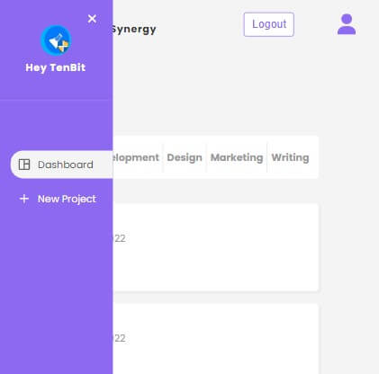
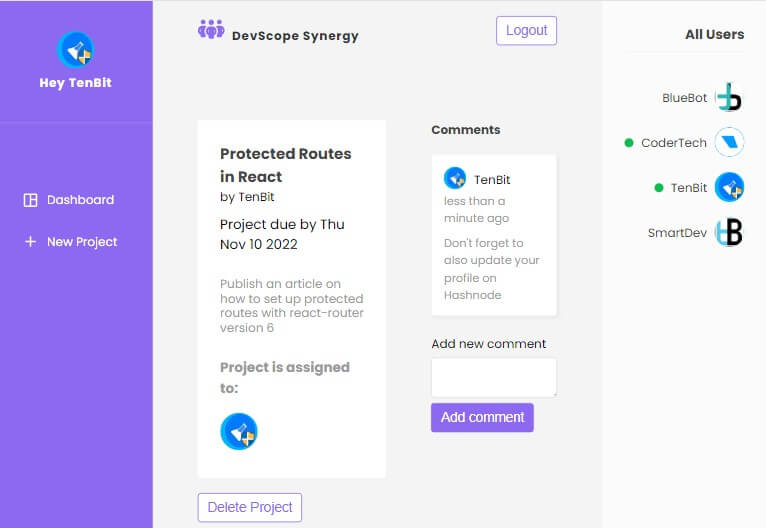
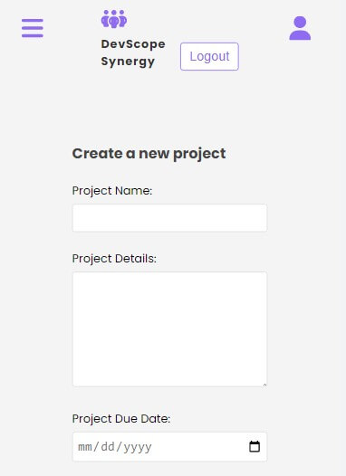

# DevScope Project Management System

A web app created with React for managing projects in a team.

## Table of contents

- [Overview](#overview)
  - [The challenge](#the-challenge)
  - [Links](#links)
- [My process](#my-process)
  - [Built with](#built-with)
  - [Screenshots](#screenshots)
  - [What I learned](#what-i-learned)
  - [Continued Learning](#Continued-Learning)
- [Useful Resources](#useful-resources)
- [Author](#author)

## Overview

### The challenge

My goal was to test my knowledge in React by building a project that brings together all I've learned so far in order to know which area I need to work on.

### Links

- Live Site URL: [Here](https://devscope-synergy.web.app/)
<!-- - Source code URL: [Here](https://github.com/SageKyle/devscope) -->

## My process

### Built with

- React JS
- React Context and Reducer
- React Custom hooks
- React Router
- CSS
- React Select
- Framer motion (animations)
- Firebase
- React-Hot-Toast (notifications)

### Screenshots

### What I learned

Through this project I learned a lot about creating a menu list with React Select, Firebase Authentication, and also how to filter items in React.

### Continued Learning

I intend to expand my knowledge In React by practicing more with the Context api and other complex React functionalities

## Useful Resources

- [The NetNinja React Course](https://github.com/iamshaunjp/Complete-React-Tutorial/)
- [Ebenezer Don's Tutorial on Framer Motion](https://www.youtube.com/watch?app=desktop&v=tBVEN6QquIM&feature=youtu.be)

## Author

- Github - [Paul Ominyi](https://github.com/SageKyle)
- Twitter - [@Ominyi_Sage](https://www.twitter.com/Ominyi_Sage)
